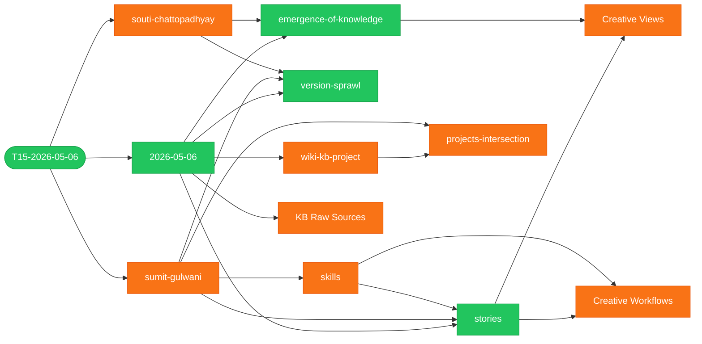

> [!note]-
> prompt: *`Show a graph of all wiki changes from the latest ingest (T15-2026-05-06) — added in green, deleted in red, changed in orange, unchanged in gray`*

# Ingest Diff — T15-2026-05-06

**Legend:** green = added · orange = changed · *(no deletions this ingest)*

## Files Changed

### Added

| File | What's new |
| ---- | ---------- |
| `wiki/concepts/stories.md` | Atomic personal anecdotes as wiki content type; priority order |
| `wiki/concepts/emergence-of-knowledge.md` | Network-analytic predictive views; divergence / link fragility |
| `wiki/concepts/version-sprawl.md` | V/M/N/T/S document chaos; per-part version control as design target |
| `wiki/events/2026-05-06.md` | Full May 6 event page: five-slide plan, three-layer arch, sponsorship goal, slop-recovery |

### Changed

| File                                                | What changed                                                                                                              |
| --------------------------------------------------- | ------------------------------------------------------------------------------------------------------------------------- |
| `wiki/people/sumit-gulwani.md`                      | May 6 contributions: stories priority, right-level-of-generality, version sprawl, demo-over-PowerPoint                    |
| `wiki/people/souti-chattopadhyay.md`                | emergence-of-knowledge, cross-team contradiction view, slop-recovery move                                                 |
| `wiki/concepts/skills.md`                           | Template extraction at right generality + distillation / debating agents / side-by-side workflows                         |
| `wiki/projects/wiki-kb-project.md`                  | Three-layer architecture section added                                                                                    |
| `wiki/index.md`                                     | 3 new concepts; May 6 entry rewritten                                                                                     |
| `views/sumit-presentation/2. KB Raw Sources.md`     | +LinkedIn saved posts, X saved posts, conversation logs with personal agents                                              |
| `views/sumit-presentation/4. Creative Views.md`     | +Predictive section (emergence, link-fragility); +Personal-Wiki section (story/analogy/slide-title libraries)             |
| `views/sumit-presentation/5. Creative Workflows.md` | +Workflows 8–12: distillation mash-up, debating agents, side-by-side refinement, grounded theory, contradiction-surfacing |
| `views/projects-intersection.md`                    | Slop-recovery added to calibrated-trust row                                                                               |
